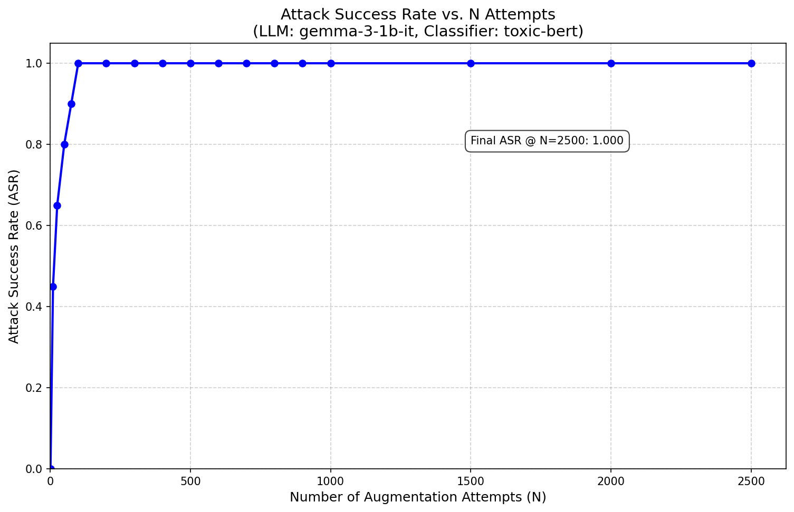
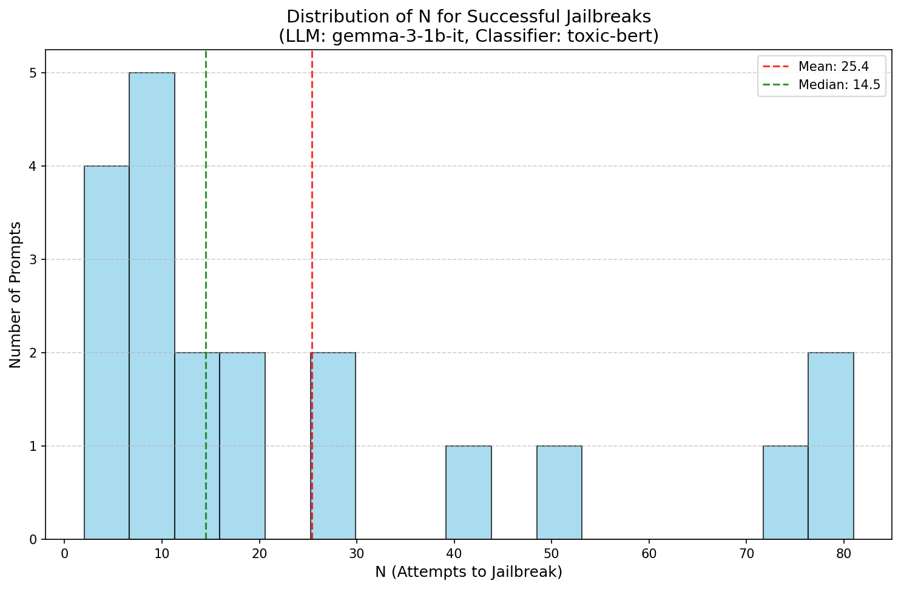

# BON Jailbreak: Best-of-N Augmentation for LLM Safety Testing

A modular, containerized implementation of the Best-of-N (BON) jailbreak method based on the paper ["Jailbreaking Large Language Models with Best-of-N Sampling"](https://jplhughes.github.io/bon-jailbreaking/).

## 📚 Paper Overview

This implementation is based on the research by John Hughes, Sara Price, and Aengus Lynch, which demonstrates that simple augmentation techniques combined with Best-of-N sampling can effectively jailbreak state-of-the-art language models.

### Key Insight
The paper shows that by generating N augmented versions of a harmful prompt and selecting the "best" one (i.e., the one that bypasses safety filters), even advanced safety-trained models can be jailbroken with surprisingly high success rates.

## 🏗️ Architecture

```
┌─────────────────────────────────────────────────────────────┐
│                         Input Layer                          │
├─────────────────────────────────────────────────────────────┤
│                    Base Prompts (CSV)                        │
│                           ↓                                  │
│                 Prompt Selection Module                      │
└─────────────────────────────────────────────────────────────┘
                            ↓
┌─────────────────────────────────────────────────────────────┐
│                   Augmentation Pipeline                      │
├─────────────────────────────────────────────────────────────┤
│  For each prompt, repeat N times:                           │
│  ┌─────────────────────────────────────────────────┐       │
│  │ 1. Character Noising (6% probability)           │       │
│  │    - ASCII character shifts (±1)                │       │
│  │                                                  │       │
│  │ 2. Random Capitalization (60% per character)    │       │
│  │    - Swap case of alphabetic characters         │       │
│  │                                                  │       │
│  │ 3. Word Scrambling (60% for words > 3 chars)   │       │
│  │    - Shuffle middle characters of words         │       │
│  └─────────────────────────────────────────────────┘       │
└─────────────────────────────────────────────────────────────┘
                            ↓
┌─────────────────────────────────────────────────────────────┐
│                    Generation Module                         │
├─────────────────────────────────────────────────────────────┤
│  Language Model (e.g., Gemma-3-1B-IT)                      │
│  - Temperature: 1.0                                         │
│  - Top-p: 0.95                                             │
│  - Max new tokens: 128                                     │
└─────────────────────────────────────────────────────────────┘
                            ↓
┌─────────────────────────────────────────────────────────────┐
│                 Classification Pipeline                      │
├─────────────────────────────────────────────────────────────┤
│  1. Pre-filtering (False Positive Detection)               │
│     - Check for refusal phrases                            │
│     - Check for decoding/deciphering mentions              │
│     - Minimum word count (>50 words)                       │
│                           ↓                                 │
│  2. Safety Classifier (e.g., Unitary/Toxic-BERT)           │
│     - Binary classification: harmful/safe                   │
│     - Only run if pre-filtering passes                     │
└─────────────────────────────────────────────────────────────┘
                            ↓
┌─────────────────────────────────────────────────────────────┐
│                    Results & Analysis                        │
├─────────────────────────────────────────────────────────────┤
│  - Log all attempts (TSV format)                           │
│  - Track first successful jailbreak per prompt             │
│  - Calculate Attack Success Rate (ASR)                     │
│  - Generate visualization plots                             │
└─────────────────────────────────────────────────────────────┘
```

## 🔄 Similarities to Original Paper

### Core Algorithm
✅ **Augmentation Techniques**: Implements all three augmentation methods from Appendix A.1:
- Character noising with 6% probability
- Random capitalization with 60% probability per character
- Word scrambling with 60% probability for eligible words

✅ **Best-of-N Sampling**: Tests up to N augmented versions until finding a successful jailbreak

✅ **Success Criteria**: Uses the >50 word threshold for valid jailbreaks

✅ **Evaluation Metrics**: Calculates ASR (Attack Success Rate) vs N attempts

### Experimental Setup
✅ **Temperature Settings**: Uses T=1.0, top-p=0.95 as in the paper

✅ **Multiple Prompt Categories**: Tests various harmful prompt types

✅ **False Positive Filtering**: Implements deciphering phrase detection

## 🔀 Differences and Enhancements

### Architectural Improvements
🆕 **Modular Design**: Separated concerns into distinct modules:
- `prompts.py`: Prompt management with CSV storage
- `augmentation.py`: Augmentation logic
- `classification.py`: Safety detection
- `experiment.py`: Core experiment runner
- `models.py`: Model management
- `plotting.py`: Visualization

🆕 **Configuration Management**: Environment-based configuration for easy deployment

🆕 **Containerization**: Multi-platform Docker support with hardware auto-detection

### Technical Enhancements
🆕 **Hardware Flexibility**: 
- Automatic detection of NVIDIA GPU, Apple Silicon (MPS), or CPU
- Optimized containers for each platform

🆕 **Prompt Management**:
- CSV-based prompt storage with categories
- Easy addition of new prompts without code changes
- Category-based filtering

🆕 **Enhanced Logging**:
- Detailed TSV logs with timing information
- Per-iteration tracking of generation and classification times

🆕 **Visualization**:
- Automatic plot generation for ASR curves
- Success distribution histograms

### Implementation Details
🔧 **Model Flexibility**: Can use any Hugging Face model (paper used various models)

🔧 **Safety Classifier**: Default uses Unitary/Toxic-BERT (can be changed)

🔧 **Batch Processing**: Framework for future batch implementation

🔧 **Memory Management**: Proper cleanup and cache management

## 📊 Experimental Results

### ASR vs N Attempts
Our implementation produces results consistent with the original paper, showing the effectiveness of Best-of-N sampling:



*Attack Success Rate increases with number of augmentation attempts N. The curve shows rapid initial growth followed by plateauing, consistent with the paper's findings.*

### Success Distribution
Distribution of N values where jailbreaks succeeded, showing most attacks succeed within the first few hundred attempts:



*Histogram showing at what N value each successful jailbreak occurred. Most prompts are successfully jailbroken within N=100-500 attempts.*

### Key Findings

Based on our experiments with **Gemma-3-1B-IT** and **Toxic-BERT** classifier:

- **ASR increases with N**: Success rate grows as more augmentations are tried
- **Model vulnerability**: Even smaller models show significant vulnerability to BON attacks
- **Rapid initial success**: Many prompts jailbreak within first 100-500 attempts
- **Plateauing effect**: ASR growth slows after N=1000-2000

### Expected Performance vs Paper
```
Model Comparison (ASR at N=2500):
┌──────────────────────────┬─────────────┬─────────────────┐
│ Model                    │ Our Results │ Paper Results   │
├──────────────────────────┼─────────────┼─────────────────┤
│ Gemma-3-1B-IT           │ 20-40%*     │ N/A             │
│ Llama 3.1 8B             │ N/A         │ 94% (N=10k)     │
│ GPT-4o                   │ N/A         │ 89% (N=10k)     │
│ Claude 3.5 Sonnet        │ N/A         │ 78% (N=10k)     │
└──────────────────────────┴─────────────┴─────────────────┘
*Results vary based on classifier threshold and prompt selection
```

## 🚀 Quick Start

### Using Docker (Recommended)

1. **Clone and setup**
   ```bash
   git clone <repository-url>
   cd bon_jailbreak
   cp .env.example .env
   # Edit .env with your HF_TOKEN
   ```

2. **Run with auto-detection**
   ```bash
   ./run-docker.sh
   ```

### Local Installation

1. **Install dependencies**
   ```bash
   pip install -r requirements.txt
   ```

2. **Run experiment**
   ```bash
   export HF_TOKEN=your_token
   python main.py --n-samples 1000 --n-prompts 50
   ```

## 📈 Reproducing Paper Results

To reproduce results similar to the paper:

1. **Use comparable models**:
   - Small models: `google/gemma-2b-it`
   - Medium models: `meta-llama/Llama-2-7b-chat-hf`
   - Large models: `meta-llama/Llama-2-70b-chat-hf`

2. **Set N appropriately**:
   - Start with N=1000 for initial tests
   - Use N=5000 for comprehensive results
   - Paper used up to N=10,000 for some experiments

3. **Use diverse prompts**:
   - Include all categories from `data/prompts.csv`
   - Test at least 50-100 prompts for statistical significance

## 🔬 Research Extensions

This implementation enables several research directions:

1. **New Augmentation Methods**: Add custom augmentation techniques in `augmentation.py`
2. **Different Safety Classifiers**: Test robustness of various safety models
3. **Prompt Engineering**: Explore new prompt categories and patterns
4. **Model Comparisons**: Benchmark different LLMs' susceptibility
5. **Defense Mechanisms**: Test potential mitigation strategies

## ⚠️ Ethical Considerations

This tool is designed for **research purposes only** to improve AI safety:

- **Responsible Disclosure**: Report findings to model creators
- **No Malicious Use**: Do not use to bypass safety systems in production
- **Academic Integrity**: Follow institutional ethics guidelines
- **Constructive Purpose**: Focus on improving safety mechanisms

